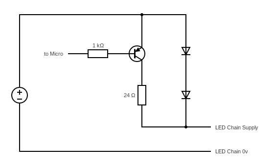

# Overview

A simple and disgusting application to control the 2-wire LED chain.

This application will run on an STM32F103 / BluePill board, and is intended to drive the "[SK LIGHTSTRING2](https://www.suck.uk.com/products/multicolour-bottle-string-light/)" product from suck UK.

## Connections

- Port B, pin 9  - LED chain, circuit below
- Port C, pin 13 - onboard LED

## Circuit

## Dependancies

- Files from `en.stm32cubef1.zip` (MD5: `03f278bcae49a7cb91b3533382ecffe3`)
  - `STM32Cube_FW_F1_V1.7.0/Drivers/CMSIS/Device/ST/STM32F1xx/Include/stm32f103x6.h`
  - `STM32Cube_FW_F1_V1.7.0/Drivers/CMSIS/Device/ST/STM32F1xx/Source/Templates/gcc/linker/STM32F103X6_FLASH.ld`
  - `STM32Cube_FW_F1_V1.7.0/Drivers/CMSIS/Device/ST/STM32F1xx/Source/Templates/gcc/startup_stm32f103x6.s`
